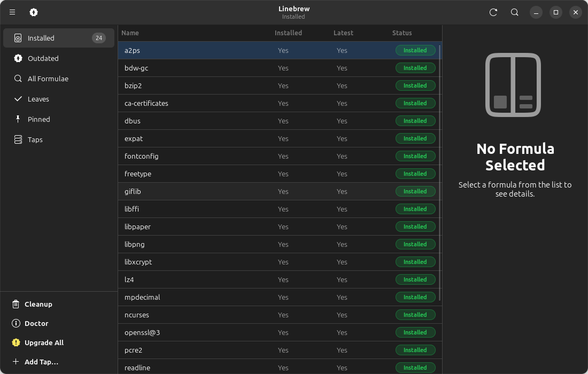

# Linebrew

A modern interface for [Homebrew](https://brew.sh) on Linux.

<a href="https://www.buymeacoffee.com/torcken" target="_blank">
  
</a>

To **support** and **maintain** this project !



---

## Features

| Feature | Details |
|---|---|
| **Sidebar categories** | Installed, Outdated, All (~7 000 formulae, virtualised), Leaves, Pinned, Taps |
| **Formula list** | Live search, sortable by name, status badges (Installed / Outdated / Pinned) |
| **Formula detail** | Name, version, description, homepage link, license, tap, dependencies, caveats |
| **Install** | `brew install <formula>` with streaming output |
| **Uninstall** | `brew uninstall` with confirmation dialog |
| **Upgrade** | Per-formula or upgrade all |
| **Pin / Unpin** | `brew pin` / `brew unpin` |
| **Taps** | Add via `brew tap` dialog; remove via `brew untap` |
| **brew update** | Fetch latest formula index |
| **brew cleanup** | Remove old downloads and cached files |
| **brew doctor** | Check for system issues |
| **Progress dialog** | Live streaming output, colour-coded (`==>` blue, errors red, success green) |
| **Preferences** | Color scheme (System/Light/Dark), update on launch, show-all on startup |
| **Notifications** | Desktop notification on operation completion |
| **GNOME HIG** | Native Adwaita look, dark-mode support, keyboard shortcuts |

---

## Keyboard Shortcuts

| Shortcut | Action |
|---|---|
| `Ctrl+R` / `F5` | Refresh current category |
| `Ctrl+F` | Focus search bar |
| `Ctrl+P` | Open Preferences |
| `Ctrl+U` | `brew update` |
| `Ctrl+Shift+C` | `brew cleanup` |
| `?` | Show keyboard shortcuts window |
| `Ctrl+Q` | Quit |

---

## Installation

### For Linux Newbies — One script installation.

No need to know anything about the terminal. Just copy and paste these lines:

```bash
git clone https://github.com/Torcken/linebrew 
cd linebrew
bash install.sh
```

That's it! The script will:
1. Detect your Linux distribution automatically (Ubuntu, Fedora, Arch, openSUSE…)
2. Install all required system packages
3. Offer to install Homebrew if it's not already on your system
4. Install Linebrew and add it to your application menu

Once it's done, search for **Linebrew** in your app launcher and open it like any other app.

> **Tip:** If the `linebrew` command isn't found after install, close and reopen your terminal, or run:
> ```bash
> export PATH="$HOME/.local/bin:$PATH"
> ```

---

### For Advanced Users 

**Step 1 — Clone the repository**

```bash
git clone https://github.com/Torcken/linebrew
cd linebrew
```

**Step 2 — Install system dependencies**

Pick your distribution:

```bash
# Ubuntu / Debian
sudo apt-get install python3-gi python3-gi-cairo gir1.2-gtk-4.0 gir1.2-adw-1 libadwaita-1-0

# Fedora
sudo dnf install python3-gobject gtk4 libadwaita

# Arch Linux
sudo pacman -S python-gobject gtk4 libadwaita

# openSUSE
sudo zypper install python3-gobject typelib-1_0-Gtk-4_0 typelib-1_0-Adw-1
```

**Step 3 — Install Linebrew**

Use the **system Python** (important — avoids GLib conflicts with conda/pyenv):

```bash
/usr/bin/python3 -m pip install --user --no-deps --break-system-packages .
```

**Step 4 — Register the app icon and desktop entry**

```bash
# Install icons at all sizes
for size in 16 22 24 32 48 64 96 128 256 512 1024; do
    mkdir -p ~/.local/share/icons/hicolor/${size}x${size}/apps
    cp data/icons/hicolor/${size}x${size}/apps/io.github.linebrew.Linebrew.png \
       ~/.local/share/icons/hicolor/${size}x${size}/apps/
done
gtk-update-icon-cache -qtf ~/.local/share/icons/hicolor

# Install .desktop file
mkdir -p ~/.local/share/applications
cp data/io.github.linebrew.Linebrew.desktop ~/.local/share/applications/
update-desktop-database ~/.local/share/applications
```

**Step 5 — Run it**

```bash
linebrew
# or
/usr/bin/python3 -m linebrew
```

---

## Requirements

* Python 3.11+
* GTK 4.0+
* libadwaita 1.2+
* PyGObject 3.44+
* [Homebrew for Linux](https://docs.brew.sh/Homebrew-on-Linux)

---

## Running from Source

```bash
git clone https://github.com/Torcken/linebrew
cd linebrew
pip install --user -e .
linebrew
# or:
python -m linebrew
```

---

<a href="https://www.buymeacoffee.com/torcken" target="_blank">
  
</a>

To **support** and **maintain** this project !

---

## License

Linebrew is licensed under the **GNU General Public License v3.0 or later**.
See [LICENSE](LICENSE) for details.

---

Made with 🤍 by Torcken
